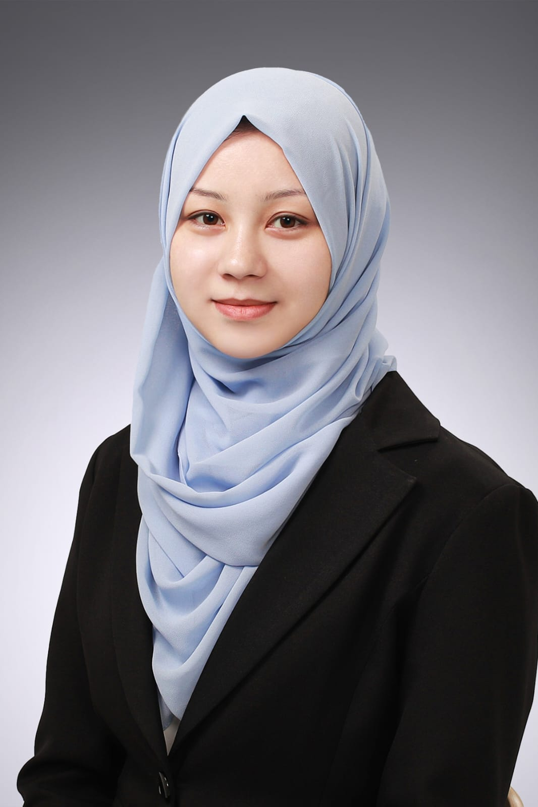

  

    
    
<strong>📠North Sydney, Australia</strong>

    
📠+61 476 813 373

    
✉️ <a href="mailto:sbatool566@gmail.com">sbatool566@gmail.com</a>

    
<a href="https://www.linkedin.com/in/shazia-batool-879654177/" target="_blank">LinkedIn Profile ➔</a>

    
<a href="https://orcid.org/0000-0002-0066-147X" target="_blank">ORCID Profile ➔</a>

    
<a href="/Curriculum Vitae of Shazia Batool.pdf" target="_blank">Download CV ➔</a>

  

  

    # Hi, I'm Shazia! Welcome to My Space 👋

    I'm a researcher, tech enthusiast, and someone who’s always been curious about how things work.  
    Right now, I’m doing my Ph.D. at Australian Catholic University in North Sydney, where I focus on making AI systems — especially large language models — more reliable and trustworthy for healthcare.

    I’m passionate about Artificial Intelligence, Machine Learning, NLP, and how technology can make people’s lives better.

    ---

    ## About Me
    A Little About My Journey

    - Ph.D. Researcher at Australian Catholic University 🇦🇺
    - Master's in Energy Engineering from Jeonbuk National University 🇰🇷
    - Bachelor's in Computer Science from BUITEMS 🇵🇰

    Along the way, I've enjoyed traveling, photography, archery, and meeting amazing people worldwide.

    ---

    ## Research & Publications
    - "Classification of Short Circuit Marks with Transfer Learning" [(JEET, 2023)](https://doi.org/10.1007/s42835-023-01490-3)
    - "Improved CNN for Fire Detection" [(INCA, 2022)](https://doi.org/10.33097/JNCTA.2022.06.10.1838)
    - "Analyzing Patient Feedback through Free Text" [(EMITTER, 2020)](https://doi.org/10.24003/emitter.v8i2.502)

    [See Full Research Work ➔](/publications)

    ---

    ## Achievements
    - 🏆 Best Paper Awards at major conferences
    - 🏹 Archery team awards
    - 📢 Global SNS Influencer recognition
    - 🎓 Multiple merit scholarships

    [Full List of Achievements ➔](/achievements)

    ---

    ## Skills
    - Python, R, Java, C++, C
    - NLP, ML, DL, Generative AI
    - Event organizing, research writing, public speaking

    ---

    ## Speaking & Events
    - 🚀 NASA Space Apps
    - 🎤 NomadHer Festival Seoul
    - 🌾 UN FAO Programs

  

